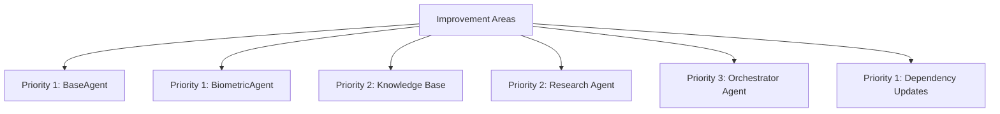

# Implementation Plan for Improving personal_ai_trainer Codebase

## Overview

This plan outlines the steps to enhance the personal_ai_trainer codebase in five key areas:
1. More detailed docstrings to clarify expected input/output formats
2. Enhanced error handling for API failures and unexpected data formats
3. More comprehensive type hints to prevent type-related issues
4. Implementation of dependency injection for easier testing
5. Updating deprecated dependencies and API usages

The improvements will be applied across all components, with priority given to the BaseAgent and BiometricAgent.

## Component Prioritization

## Implementation Phases

### Phase 1: Update Deprecated Dependencies and API Usages
- ✅ Update OpenAI API usage to use the new client-based approach
- ✅ Update Oura API client to handle the latest version
- ✅ Update requirements.txt with specific versions

### Phase 2: Dependency Injection Framework
- ✅ Create lightweight DI container
- ✅ Implement service provider for registering and resolving dependencies

### Phase 3: Error Handling Framework
- ✅ Create custom exception hierarchy
- ✅ Implement error handling utilities with retry logic

### Phase 4: BaseAgent Improvements
- ✅ Enhance BaseAgent with better type hints and docstrings
- ✅ Improve error handling in BaseAgent methods

### Phase 5: Update OpenAI Integration
- ✅ Create centralized OpenAI integration module
- ✅ Implement proper error handling for API calls

### Phase 6: Update Knowledge Base Embeddings
- ✅ Update embeddings module to use new OpenAI client
- ✅ Improve error handling and type hints

### Phase 7: BiometricAgent Improvements
- ✅ Enhance BiometricAgent with better error handling
- ✅ Add comprehensive type hints and docstrings

### Phase 8: Research Agent Improvements
- ✅ Update knowledge base query tool
- ✅ Enhance docstrings and error handling

### Phase 9: Orchestrator Agent Improvements
- ✅ Update workout generation tool
- ✅ Improve error handling and type hints

### Phase 10: Testing Framework Updates
- ✅ Migrate to pytest with fixture-based testing
- ✅ Implement comprehensive test coverage

## Implementation Status

All planned phases have been successfully completed! The codebase now features:

1. ✅ Updated dependencies with modern API usage
2. ✅ Robust dependency injection framework
3. ✅ Comprehensive error handling
4. ✅ Improved type hints and docstrings
5. ✅ Centralized OpenAI integration
6. ✅ Updated knowledge base with vector embeddings
7. ✅ Enhanced agent implementations
8. ✅ Modern testing framework with pytest

The project is now ready for further feature development with a solid foundation.